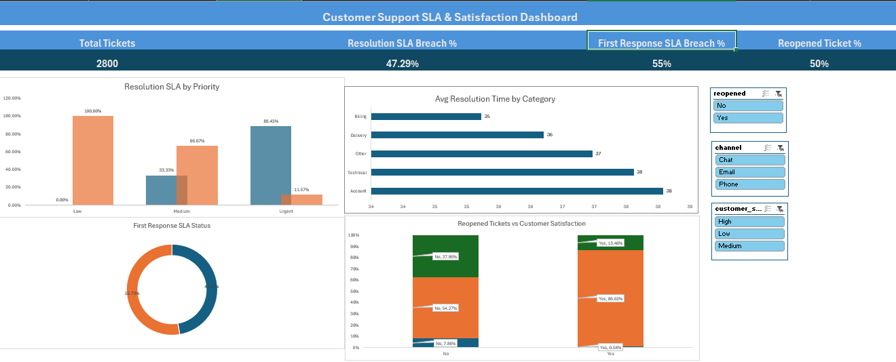
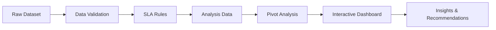

# Customer Support SLA & Satisfaction Analysis Using Excel


---

## Project Preview

This project analyzes customer support ticket performance using Excel.  
The goal is to identify SLA breaches, first response delays, reopened ticket patterns, and customer satisfaction issues.

The final output is an interactive Excel dashboard with KPI cards, slicers, pivot charts, business insights, and operational recommendations.

---

## Dashboard Snapshot



---

## Business Problem

Customer support teams need to resolve tickets within agreed SLA timelines while maintaining customer satisfaction.

However, delays in first response, poor first-time resolution, and high reopened ticket rates can reduce customer trust and increase support workload.

This project answers:

* Are support tickets being resolved within SLA?
* Which priority level has the highest SLA breach?
* Which issue categories take the longest to resolve?
* Are reopened tickets linked with lower customer satisfaction?
* Which operational actions can reduce delays and improve support quality?

---

## Dataset Overview

The dataset contains customer support ticket records with information about ticket priority, issue category, response time, resolution time, agent experience, reopened status, channel, and customer satisfaction.

| Field                    | Description                        |
| ------------------------ | ---------------------------------- |
| `ticket_id`              | Unique ticket identifier           |
| `created_date`           | Ticket creation date               |
| `issue_category`         | Type of customer issue             |
| `priority`               | Ticket priority level              |
| `first_response_minutes` | Time taken for first response      |
| `resolution_time_hours`  | Time taken to resolve the ticket   |
| `agent_experience_years` | Experience level of assigned agent |
| `reopened`               | Whether the ticket was reopened    |
| `channel`                | Support channel used               |
| `customer_satisfaction`  | Customer satisfaction level        |

---

## Tools Used

| Tool              | Purpose                          |
| ----------------- | -------------------------------- |
| Microsoft Excel   | Main analysis and dashboard tool |
| Excel Tables      | Structured data handling         |
| Data Validation   | Dataset quality checks           |
| XLOOKUP           | SLA rule mapping                 |
| IF / IFS / SWITCH | Business logic creation          |
| Pivot Tables      | Aggregated analysis              |
| Pivot Charts      | Visual analysis                  |
| Slicers           | Interactive filtering            |

---

## Project Workflow



---

## Workbook Structure

| Sheet             | Purpose                                  |
| ----------------- | ---------------------------------------- |
| `README`          | Project summary inside workbook          |
| `Raw_Data`        | Original dataset                         |
| `Data_Validation` | Duplicate, missing, invalid value checks |
| `SLA_Rules`       | SLA threshold table by priority          |
| `Analysis_Data`   | Calculated business metrics              |
| `Pivot_Analysis`  | Pivot tables used for dashboard          |
| `Dashboard`       | Interactive KPI and chart dashboard      |
| `Recommendations` | Business insights and action plan        |

---

## SLA Rules Used

| Priority | Resolution SLA Hours | First Response SLA Minutes |
| -------- | -------------------: | -------------------------: |
| Urgent   |                    8 |                         30 |
| High     |                   24 |                         60 |
| Medium   |                   48 |                        120 |
| Low      |                   72 |                        240 |

---

## Key Calculated Fields

| Calculated Field            | Purpose                                      |
| --------------------------- | -------------------------------------------- |
| `Resolution SLA Status`     | Flags tickets as Breached or Within SLA      |
| `First Response SLA Status` | Flags delayed first responses                |
| `Agent Experience Band`     | Groups agents by experience                  |
| `Satisfaction Score`        | Converts satisfaction into numeric score     |
| `Reopened Score`            | Converts reopened status into numeric format |
| `Ticket Month`              | Enables monthly trend analysis               |
| `Priority Rank`             | Sorts priorities in business order           |

---

## Dashboard KPIs

| KPI                         | Result |
| --------------------------- | -----: |
| Total Tickets               |  2,800 |
| Resolution SLA Breach %     | 47.29% |
| First Response SLA Breach % | 55.00% |
| Reopened Ticket %           | 50.00% |

---

## Dashboard Charts

| Chart                               | Business Question Answered                          |
| ----------------------------------- | --------------------------------------------------- |
| Resolution SLA by Priority          | Which priority breaches SLA the most?               |
| Average Resolution Time by Category | Which issue categories take longest to resolve?     |
| First Response SLA Status           | Are customers receiving timely first responses?     |
| Reopened vs Satisfaction            | Are reopened tickets linked with poor satisfaction? |

---

## Key Insights

| Insight                                   |                Evidence | Business Meaning                                        |
| ----------------------------------------- | ----------------------: | ------------------------------------------------------- |
| Resolution SLA breach is high             |                  47.29% | Almost half of tickets are not resolved within SLA      |
| First response delay is a major issue     |           55.00% breach | Customers wait too long before first support response   |
| Urgent tickets are the biggest risk       |         88.43% breached | High-priority tickets are not being handled fast enough |
| Reopened tickets are very high            |                  50.00% | First-time resolution quality is weak                   |
| Reopened tickets hurt satisfaction        | 86.02% low satisfaction | Poor resolution quality damages customer experience     |
| Account and Technical issues take longest |         Around 38 hours | These categories need better support playbooks          |

---

## Recommendations

| Finding                                  | Recommendation                                                       | Priority |
| ---------------------------------------- | -------------------------------------------------------------------- | -------- |
| Urgent tickets have high SLA breach      | Create a dedicated urgent-ticket queue and assign experienced agents | High     |
| First response SLA breach is high        | Set first-response alerts and use response templates                 | High     |
| Reopened ticket rate is high             | Add a closure checklist before resolving tickets                     | High     |
| Reopened tickets show low satisfaction   | Review reopened tickets and identify repeat failure reasons          | High     |
| Account and Technical issues take longer | Build troubleshooting guides and assign specialists                  | Medium   |
| Medium priority tickets show delay       | Monitor aging medium-priority tickets weekly                         | Medium   |

---

## Business Impact

This dashboard helps support managers:

* Track SLA performance quickly
* Identify high-risk ticket priorities
* Detect slow issue categories
* Understand satisfaction problems
* Reduce reopened tickets
* Improve first-response speed
* Prioritize operational improvements

---

## Skills Demonstrated

* Excel data validation
* Structured table design
* SLA rule mapping
* Business logic creation
* Pivot table analysis
* Pivot chart dashboarding
* Slicer-based interactivity
* KPI reporting
* Customer support analytics
* Business recommendation writing

---

## Project Outcome

The analysis shows that support performance is mainly affected by delayed first responses, high resolution SLA breaches, and poor first-time resolution.

Although low-priority tickets are handled within SLA, urgent tickets show an 88.43% SLA breach rate, making them the highest operational risk.

Reopened tickets account for 50% of total tickets and are strongly associated with low customer satisfaction, with 86.02% of reopened tickets receiving low satisfaction.

The recommended actions are to create a dedicated urgent-ticket queue, improve first-response monitoring, introduce closure quality checks, and build troubleshooting guides for high-resolution-time categories such as Account and Technical issues.

---

## Repository Contents

```text
Customer_Support_SLA_Excel_Project/
│
├── Dataset/
│   └── customer_support_ticket_dataset.csv
│
├── Excel_Workbook/
│   └── Customer_Support_SLA_Analysis.xlsx
│
├── Dashboard_Screenshots/
│   └── dashboard_screenshot.png
│
└── README.md
```

---

## How to Use This Project

<details>
<summary>Click to expand project usage steps</summary>

1. Open the Excel workbook.
2. Go to the `Dashboard` sheet.
3. Use slicers to filter by priority, issue category, channel, reopened status, or satisfaction.
4. Review KPI cards and charts.
5. Check the `Recommendations` sheet for business actions.
6. Review `Pivot_Analysis` to understand how dashboard values were created.

</details>

---

## Final Note

This project is not just a dashboard.
It demonstrates how Excel can be used to convert support ticket data into business decisions through validation, SLA logic, interactive reporting, and recommendation-driven analysis.
